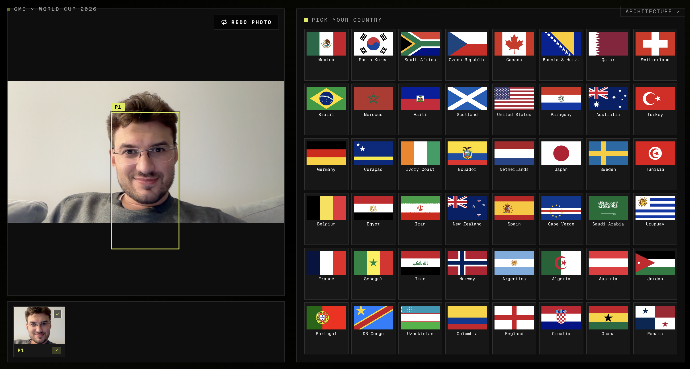
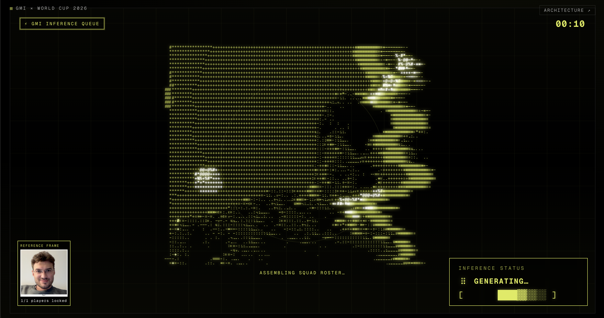

# GMI × World Cup 2026

Kiosk-style web app — snap a webcam photo, pick a country, get an AI-generated team photo of yourself in that nation's World Cup 2026 jersey.

Built for **Google I/O Kickoff: Pre-World Cup Hack** · Newport Beach GDG.
Sponsors: GMI · NVIDIA · GDG Newport Beach · RocketRide.

---

## How it works

### 1. Pick your photo & country



Webcam capture in the browser. MediaPipe BlazeFace (WASM) detects every face in the frame client-side — no server round-trip for detection. Tap a country flag from the 48-nation World Cup 2026 grid and generation fires automatically.

### 2. AI generates the team photo



Each face crop is normalized to 512×512 and sent in parallel to **Gemini 3.1 Flash Lite** for structured attribute extraction (age band, hair, glasses, etc.). The labeled reference collage plus per-player guides go to **Gemini 3.1 Flash Image (preview)** on the GMI Cloud async queue (~15s). ASCII portrait + progress bar play during the wait.

### 3. Download or share


Server composites a trading-card frame over the output via Pillow. The result page offers a direct download, a QR code for phone hand-off, and auto-returns to the camera after the countdown.

---

## Stack

- **Frontend:** vanilla JS (`index.html`), MediaPipe BlazeFace WASM, Canvas collage builder.
- **Backend:** Flask (`server.py`) on port 5050, Pillow for frame compositing.
- **Storage:** Supabase object storage (`db.py`) — flat `photos/`, `faces/`, `generations/` buckets with `.jpg` + `.json` sidecars.
- **Models** (all routed through GMI Cloud):
  - Vision: `google/gemini-3.1-flash-lite-preview`
  - Generate: `gemini-3.1-flash-image-preview` (override with `EDIT_MODEL=gpt-image-2-edit`)
  - Identity score (bench tool): `openai/gpt-4o`

Full pipeline diagram: [/architecture](http://127.0.0.1:5050/architecture) once the server is running.

---

## Run it locally

```bash
cp .env.example .env          # fill in GMI_API_KEY (+ optional Supabase keys)
python -m venv .venv
source .venv/bin/activate
pip install -r requirements.txt
python server.py              # → http://127.0.0.1:5050
```
